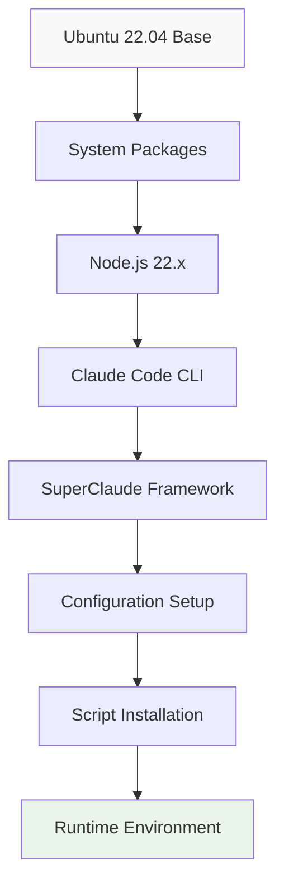
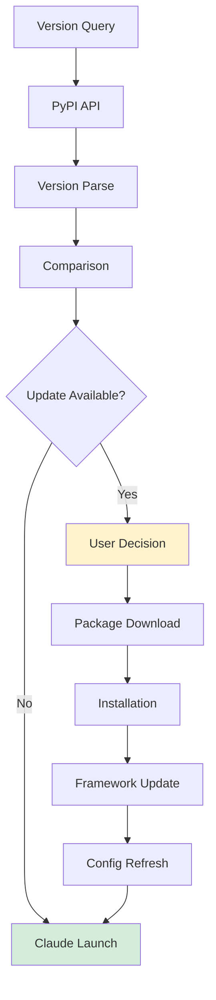
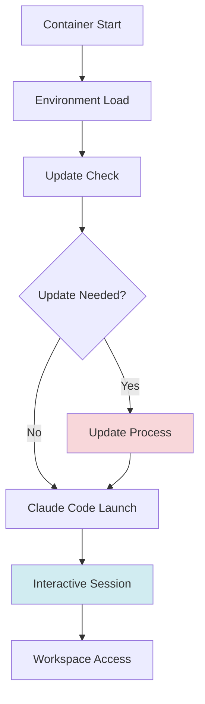

# API ve Yapı Dokümantasyonu

## 🔌 API Entegrasyonları

### Anthropic API Konfigürasyonu
```yaml
endpoint: "https://api.z.ai/api/anthropic"
authentication:
  method: "Token-based"
  header: "Authorization: Bearer {ANTHROPIC_AUTH_TOKEN}"
  token_location: "environment variable"

model_mapping:
  sonnet: "glm-4.6"
  opus: "glm-4.6"
  haiku: "glm-4.5-air"

authentication_bypass:
  enabled: true
  flag: "CLAUDE_CODE_SKIP_AUTH_LOGIN=1"
```

### Paket Yönetimi API'leri
```yaml
pypi_api:
  endpoint: "https://pypi.org/pypi/SuperClaude/json"
  purpose: "Latest version detection"
  method: "GET"
  parsing: "pip index versions command"

nodesource_api:
  endpoint: "https://deb.nodesource.com/setup_22.x"
  purpose: "Node.js 22.x installation"
  method: "curl and bash execution"
```

## 🏗️ Sistem Yapılandırması

### Dockerfile Mimarişi
```dockerfile
# Çok Aşamalı Build Süreci
FROM ubuntu:22.04

# Temel Sistem Kurulumu
ENV DEBIAN_FRONTEND=noninteractive
ENV TZ=Etc/UTC

# Sistem Bağımlılıkları
RUN apt-get update && apt-get install -y \
    curl bash ca-certificates git python3 python3-pip \
    && rm -rf /var/lib/apt/lists/*

# Node.js Kurulumu
RUN curl -fsSL https://deb.nodesource.com/setup_22.x | bash - && \
    apt-get install -y nodejs && \
    npm install -g npm@latest

# Claude Code CLI Kurulumu
RUN curl -fsSL https://claude.ai/install.sh | bash || true

# Binary Path Yönetimi
RUN if [ -f "/root/.local/bin/claude" ]; then cp /root/.local/bin/claude /usr/local/bin/claude; fi && \
    if [ -f "/root/.claude/bin/claude" ]; then cp /root/.claude/bin/claude /usr/local/bin/claude; fi && \
    chmod +x /usr/local/bin/claude

# SuperClaude Framework Kurulumu
RUN pip install --upgrade pip && pip install SuperClaude

# Otomatik Konfigürasyon (Expect Script)
RUN apt-get update && apt-get install -y expect && rm -rf /var/lib/apt/lists/* && \
    /usr/bin/expect <<'EOD'
    spawn SuperClaude install --force --yes
    set timeout -1
    expect {
        -re "Which" { send "all\r"; exp_continue }
        -re "Select" { send "all\r"; exp_continue }
        -re "Proceed" { send "y\r"; exp_continue }
        -re "overwrite" { send "y\r"; exp_continue }
        eof
    }
EOD

# Plugin Sistemi Kurulumu
RUN mkdir -p /root/.claude/plugins && \
    ln -s $(which SuperClaude) /root/.claude/plugins/sc || true

# Ortam Değişkenleri ve PATH
ENV CLAUDE_HOME=/root/.claude
ENV CLAUDE_DISABLE_PLUGINS=true
ENV PATH="/root/.local/bin:/usr/local/bin:$PATH"
```

### Docker Compose Servis Yapısı
```yaml
services:
  claude:
    build: .
    container_name: claude-code
    env_file:
      - .env
    stdin_open: true          # Etkileşimli shell için
    tty: true                 # Terminal ayırma için
    working_dir: /workspace
    environment:
      - CLAUDE_HOME=/root/.claude
      - CLAUDE_DISABLE_PLUGINS=true
      - SUPERCLAUDE_PATH=/opt/SuperClaude_Framework
      - PATH="/opt/SuperClaude_Framework/bin:$PATH"
    volumes:
      - ${LOCAL_PATH}:/workspace                    # Workspace persistency
      - ${LOCAL_PATH}/empty:/workspace/.claude      # Configuration isolation
    restart: unless-stopped                         # Dayanıklılık için
```

## 🔄 Script Otomasyon Sistemi

### Başlangıç Script'i (startup.sh)
```bash
#!/bin/bash
set -o pipefail

# SuperClaude Entegrasyonu
echo 'alias sc="SuperClaude"' >> ~/.bashrc
export PATH="/root/.local/bin:$PATH"
mkdir -p /root/.claude/plugins
ln -sf $(which SuperClaude) /root/.claude/plugins/sc || true

# Otomatik Başlatma
echo "🚀 Güncelleme kontrolü yapılıyor, ardından Claude Code başlatılacak..."
AUTO_START_CLAUDE=true exec bash /usr/local/bin/check_update.sh
```

### Güncelleme Kontrol Script'i (check_update.sh)
```bash
#!/bin/bash
set -e

# Konfigürasyon
LOG_FILE="/tmp/sc_update.txt"
RED='\033[0;31m'
GREEN='\033[0;32m'
YELLOW='\033[1;33m'
BLUE='\033[0;34m'
NC='\033[0m'

# Otomatik Başlatma Modu
AUTO_START=false
if [ "$1" == "--auto-start" ] || [ "$AUTO_START_CLAUDE" == "true" ]; then
  AUTO_START=true
fi

# Logging Konfigürasyonu
if [ "$AUTO_START" != "true" ]; then
  exec > >(tee -a "$LOG_FILE") 2>&1
fi

# Sürüm Tespiti
echo -e "${BLUE}🔍 SuperClaude sürümü kontrol ediliyor...${NC}"

LATEST=$(pip index versions SuperClaude 2>/dev/null | grep -oP 'Available versions: \K.*' | awk -F',' '{print $1}' | tr -d '[:space:]')
CURRENT=$(pip show SuperClaude 2>/dev/null | grep Version | awk '{print $2}' | tr -d '[:space:]')

# Sürüm Temizleme ve Karşılaştırma
LATEST=$(echo "$LATEST" | sed 's/[^0-9\.]//g')
CURRENT=$(echo "$CURRENT" | sed 's/[^0-9\.]//g')

# Güncelleme Karar Mantığı
if [ -z "$LATEST" ] || [ -z "$CURRENT" ]; then
  echo -e "${YELLOW}⚠️  SuperClaude sürüm bilgisi alınamadı.${NC}"
else
  ORDER=$(printf "%s\n%s" "$CURRENT" "$LATEST" | sort -V | head -n1)
  if [ "$ORDER" = "$LATEST" ] && [ "$CURRENT" != "$LATEST" ]; then
    echo -e "${RED}🚨 Yeni SuperClaude sürümü bulundu: $LATEST (şu anki: $CURRENT)${NC}"

    # Etkileşimli Güncelleme Menüsü
    if [ "$AUTO_START" = "true" ]; then
      echo -e "${YELLOW}⏩ Otomatik mod: Güncelleme atlandı, Claude başlatılıyor...${NC}"
    else
      echo
      echo -e "${YELLOW}🟡 Ne yapmak istersin?${NC}"
      echo " [1] SuperClaude'u Güncelle"
      echo " [2] Güncellemeyi Atla"
      echo " [3] Çık"
      echo
      read -p "Seçimin (1/2/3): " choice

      case $choice in
        1)
          echo -e "${BLUE}⏫ SuperClaude güncelleniyor...${NC}"
          bash /usr/local/bin/update_now.sh
          echo -e "${GREEN}✅ Güncelleme tamamlandı!${NC}"
          ;;
        2)
          echo -e "${YELLOW}⏩ Güncelleme atlandı.${NC}"
          ;;
        3)
          echo -e "${RED}🚪 Çıkılıyor...${NC}"
          exit 0
          ;;
        *)
          echo -e "${YELLOW}⚠️  Geçersiz seçim, güncelleme atlandı.${NC}"
          ;;
      esac
    fi
  else
    echo -e "${GREEN}✅ SuperClaude güncel ($CURRENT)${NC}"
  fi
fi

# Claude Code Başlatma
echo
echo -e "${GREEN}✅ Güncelleme kontrolü tamamlandı.${NC}"
echo -e "${BLUE}🚀 Claude Code başlatılıyor...${NC}"
sleep 0.5
script -q -c "claude" /dev/null
```

### Güncelleme Script'i (update_now.sh)
```bash
#!/bin/bash
set -e
RED='\033[0;31m'; GREEN='\033[0;32m'; NC='\033[0m'

echo -e "${GREEN}⏫ SuperClaude güncelleniyor...${NC}"
pip install --upgrade SuperClaude --break-system-packages -q
echo -e "1\ny\n" | SuperClaude update --force --yes || true
echo -e "${GREEN}✅ SuperClaude başarıyla güncellendi.${NC}"
```

## 📊 Veri Akış Diyagramları

### Build Pipeline Veri Akışı


### Güncelleme Veri Akışı


### Çalışma Zamanı Veri Akışı


## 🔧 Ortam Değişkeni Hiyerarşisi

```yaml
Konfigürasyon Katmanları:
  1. Host Ortamı:
     - Docker daemon
     - Sistem environment variables

  2. .env Dosyası:
     - Docker compose environment
     - API configuration
     - Path mappings

  3. Konteyner Ortamı:
     - Runtime configuration
     - Claude home directory
     - Plugin management

  4. Runtime Script'leri:
     - Dynamic configuration
     - Update management
     - Startup logic
```

## 🚨 Hata Yönetimi ve Dayanıklılık

### Hata Yakalama Stratejileri
```bash
# Expect Script Hata Yönetimi
RUN curl -fsSL https://claude.ai/install.sh | bash || true

# Güncelleme Hata Yönetimi
echo -e "1\ny\n" | SuperClaude update --force --yes || true

# Script Hata Yönetimi
set -o pipefail    # Pipeline hatalarını yakala
set -e             # Exit on error
```

### Log Yönetimi
```bash
# Log Dosyası Konfigürasyonu
LOG_FILE="/tmp/sc_update.txt"

# Conditional Logging
if [ "$AUTO_START" != "true" ]; then
  exec > >(tee -a "$LOG_FILE") 2>&1
fi
```

### Graceful Degradation
- Sürüm tespiti başarısız olduğunda devam et
- Güncelleme hatalarında Claude'u başlat
- Expect script hatalarını görmezden gel
- Network sorunlarında yerel kurulumu kullan

## 🔍 Sistem İzleme ve Debug

### Log Dosyaları
- `/tmp/sc_update.txt` - Güncelleme işlem logları
- Docker container logları - `docker-compose logs claude`
- Claude Code logları - Konteyner içinde çalışma zamanı logları

### Debug Komutları
```bash
# Sürüm Bilgisi Kontrolü
pip show SuperClaude
pip index versions SuperClaude

# Konteyner Durumu Kontrolü
docker-compose ps
docker-compose exec claude env | grep CLAUDE

# SuperClaude Durumu
sc --version
sc status
```

Bu dokümantasyon, Claude Docker projesinin API entegrasyonlarını, sistem yapılandırmasını ve otomasyon mekanizmalarını kapsamlı bir şekilde açıklamaktadır.