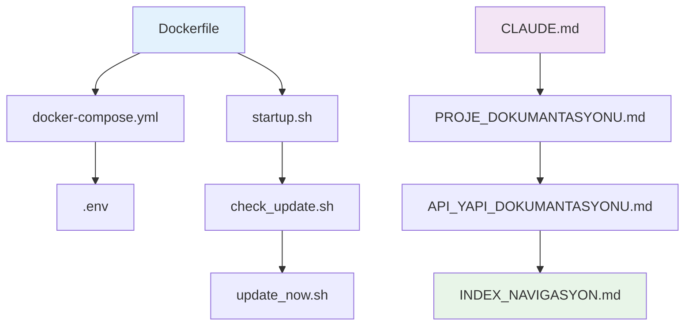

# 📚 Proje İndeksi ve Navigasyon

## 🗂️ Dokümantasyon Haritası

### Ana Dokümanlar
| Doküman | Amaç | Hedef Kitle |
|---------|------|-------------|
| [**PROJE_DOKUMANTASYONU.md**](./PROJE_DOKUMANTASYONU.md) | Genel proje bakışı ve mimari | Geliştiriciler, DevOps |
| [**API_YAPI_DOKUMANTASYONU.md**](./API_YAPI_DOKUMANTASYONU.md) | API entegrasyonları ve sistem yapısı | Teknik ekipler |
| [**CLAUDE.md**](./CLAUDE.md) | Claude Code rehberi | Kullanıcılar |

### Çapraz Referans Tablosu

## 🔗 Bileşen İlişkileri

### Dosya Bağımlılıkları


### Konu Bazlı Navigasyon

#### 🚀 Hızlı Başlangıç
- **Yeni Kullanıcılar**: [PROJE_DOKUMANTASYONU.md](./PROJE_DOKUMANTASYONU.md#🚀-kullanım-komutları)
- **Kurulum**: [API_YAPI_DOKUMANTASYONU.md](./API_YAPI_DOKUMANTASYONU.md#🏗️-sistem-yapılandırması)
- **Yapılandırma**: [PROJE_DOKUMANTASYONU.md](./PROJE_DOKUMANTASYONU.md#🔧-ortam-yapılandırması)

#### 🔧 Geliştirme ve Bakım
- **Güncelleme Yönetimi**: [PROJE_DOKUMANTASYONU.md](./PROJE_DOKUMANTASYONU.md#⬆️-güncelleme-sistemi-mimarisi)
- **API Entegrasyonu**: [API_YAPI_DOKUMANTASYONU.md](./API_YAPI_DOKUMANTASYONU.md#🔌-api-entegrasyonları)
- **Hata Ayıklama**: [API_YAPI_DOKUMANTASYONU.md](./API_YAPI_DOKUMANTASYONU.md#🚨-hata-yönetimi-ve-dayanıklılık)

#### 🏗️ Mimarik ve Tasarım
- **Sistem Mimarisi**: [PROJE_DOKUMANTASYONU.md](./PROJE_DOKUMANTASYONU.md#🏗️-sistem-mimarisi)
- **Veri Akışları**: [API_YAPI_DOKUMANTASYONU.md](./API_YAPI_DOKUMANTASYONU.md#📊-veri-akış-diyagramları)
- **Güvenlik**: [PROJE_DOKUMANTASYONU.md](./PROJE_DOKUMANTASYONU.md#🛡️-güvenlik-hususları)

## 📋 İçerik İndeksi

### Temel Kavramlar
- **Konteynerizasyon**: Docker tabanlı geliştirme ortamı
- **Otomasyon**: Güncelleme ve başlatma süreçleri
- **Entegrasyon**: Claude Code + SuperClaude framework
- **Yerelleştirme**: Türkçe arayüz ve mesajlaşma

### Teknik Bileşenler
- **Dockerfile**: Ubuntu 22.04 tabanlı çok aşamalı build
- **Docker Compose**: Servis orkestrasyonu ve volume yönetimi
- **Shell Script'leri**: Bash tabanlı otomasyon script'leri
- **Ortam Değişkenleri**: Çok katmanlı yapılandırma yönetimi

### İşlevsellik Alanları
- **Geliştirme Ortamı**: Etkileşimli CLI erişimi
- **Güncelleme Sistemi**: Otomatik sürüm kontrolü ve güncelleme
- **API Yönetimi**: Anthropic API entegrasyonu
- **Konfigürasyon**: Esnek ortam değişkeni yönetimi

## 🎯 Kullanım Senaryoları

### Senaryo 1: İlk Kurulum ve Başlatma
```
1. 📁 Proje dizinine git
2. 🔧 .env dosyasını yapılandır
3. 🐳 docker-compose up -d --build
4. ✅ Konteyner durumu kontrolü
5. 🚀 Claude Code başlatma
```
**İlgili Dokümanlar**: [PROJE_DOKUMANTASYONU.md](./PROJE_DOKUMANTASYONU.md#🚀-kullanım-komutları)

### Senaryo 2: Güncelleme Yönetimi
```
1. 📊 Mevcut sürüm kontrolü
2. 🔍 Güncelleme kontrolü çalıştırma
3. ⚡ Güncelleme kararı verme
4. 📦 Güncelleme işlemini başlatma
5. ✅ Başarılı güncelleme doğrulama
```
**İlgili Dokümanlar**: [PROJE_DOKUMANTASYONU.md](./PROJE_DOKUMANTASYONU.md#⬆️-güncelleme-sistemi-mimarisi), [API_YAPI_DOKUMANTASYONU.md](./API_YAPI_DOKUMANTASYONU.md#🔄-script-otomasyon-sistemi)

### Senaryo 3: Sorun Giderme
```
1. 🔍 Log dosyalarını kontrol et
2. 📊 Konteyner durumunu analiz et
3. 🚨 Hata mesajlarını değerlendir
4. 🔧 Çözüm uygula
5. ✅ Sistem doğrulaması yap
```
**İlgili Dokümanlar**: [API_YAPI_DOKUMANTASYONU.md](./API_YAPI_DOKUMANTASYONU.md#🚨-hata-yönetimi-ve-dayanıklılık)

### Senaryo 4: Geliştirme ve Özelleştirme
```
1. 🏗️ Mimariyi anlama
2. 🔧 Konfigürasyon özelleştirme
3. 📝 Script modifikasyonu
4. 🧪 Test ve doğrulama
5. 📚 Dokümantasyon güncelleme
```
**İlgili Dokümanlar**: [API_YAPI_DOKUMANTASYONU.md](./API_YAPI_DOKUMANTASYONU.md#🏗️-sistem-yapılandırması), [PROJE_DOKUMANTASYONU.md](./PROJE_DOKUMANTASYONU.md#📊-teknik-i̇lişkiler-ve-veri-akışları)

## 🔍 Hızlı Arama İndeksi

### Dosya İçeriği Haritası
| Konu | Dosya | Bölüm |
|------|-------|-------|
| Docker kurulumu | Dockerfile | Tüm dosya |
| Servis yönetimi | docker-compose.yml | Tüm dosya |
| Ortam değişkenleri | .env | Tüm dosya |
| Başlangıç süreci | startup.sh | SuperClaude entegrasyonu |
| Güncelleme mantığı | check_update.sh | Sürüm karşılaştırma ve kullanıcı etkileşimi |
| Güncelleme uygulaması | update_now.sh | Paket güncellemesi |
| Genel bakış | PROJE_DOKUMANTASYONU.md | Tüm bölümler |
| API detayları | API_YAPI_DOKUMANTASYONU.md | Tüm bölümler |
| Claude kullanımı | CLAUDE.md | Komutlar ve iş akışları |

### Komut Referansı
| Kategori | Komut | Açıklama | Doküman |
|----------|-------|----------|---------|
| **Docker** | `docker-compose up -d --build` | Build ve başlat | [PROJE_DOKUMANTASYONU.md](./PROJE_DOKUMANTASYONU.md#🚀-kullanım-komutları) |
| **Docker** | `docker-compose exec claude bash` | Konteyner erişimi | [PROJE_DOKUMANTASYONU.md](./PROJE_DOKUMANTASYONU.md#🚀-kullanım-komutları) |
| **Güncelleme** | `check_update.sh` | Güncelleme kontrolü | [PROJE_DOKUMANTASYONU.md](./PROJE_DOKUMANTASYONU.md#⬆️-güncelleme-sistemi-mimarisi) |
| **Güncelleme** | `update_now.sh` | Güncelleme uygula | [PROJE_DOKUMANTASYONU.md](./PROJE_DOKUMANTASYONU.md#⬆️-güncelleme-sistemi-mimarisi) |
| **SuperClaude** | `sc help` | Yardım | [PROJE_DOKUMANTASYONU.md](./PROJE_DOKUMANTASYONU.md#🚀-kullanım-komutları) |
| **Debug** | `pip show SuperClaude` | Sürüm bilgisi | [API_YAPI_DOKUMANTASYONU.md](./API_YAPI_DOKUMANTASYONU.md#🔍-sistem-izleme-ve-debug) |

## 🎨 Temel Renk ve Sembol Kodları

### Renk Kodlaması
- 🟡 **Sarı**: Uyarılar, kullanıcı promptları
- 🔵 **Mavi**: Bilgilendirici mesajlar, süreç başlangıcı
- 🟢 **Yeşil**: Başarı durumları, tamamlanan işlemler
- 🔴 **Kırmızı**: Hatalar, kritik bildirimler

### Sembol Anlamları
- 🐳 Docker konteyner işlemleri
- 🚀 Başlatma ve çalıştırma işlemleri
- 🔄 Güncelleme ve tekrar eden işlemler
- 🔧 Yapılandırma ve ayarlar
- 📊 Veri akışı ve analiz
- 🔍 Arama ve kontrol işlemleri
- 🛡️ Güvenlik ve izolasyon
- 📚 Dokümantasyon ve bilgi

## 📝 Notlar ve Güncellemeler

### Dokümantasyon Sürümü
- **Sürüm**: 1.0
- **Oluşturulma**: 2025-11-08
- **Dil**: Türkçe
- **Format**: Markdown

### Bakım Notları
- Bu doküman proje yapısındaki değişikliklerle güncellenmelidir
- Yeni özellikler eklendiğinde ilgili bölümler güncellenmeli
- Kullanıcı geri bildirimleri doğrultusunda iyileştirmeler yapılabilir

---

**💡 İpucu**: Bu indeks dokümanını projeye hızlı adapte olmak için kullanabilirsiniz. İhtiyacınız olan bilgiyi hızlıca bulmak için yukarıdaki çapraz referans tablosunu ve arama indeksini kullanın.